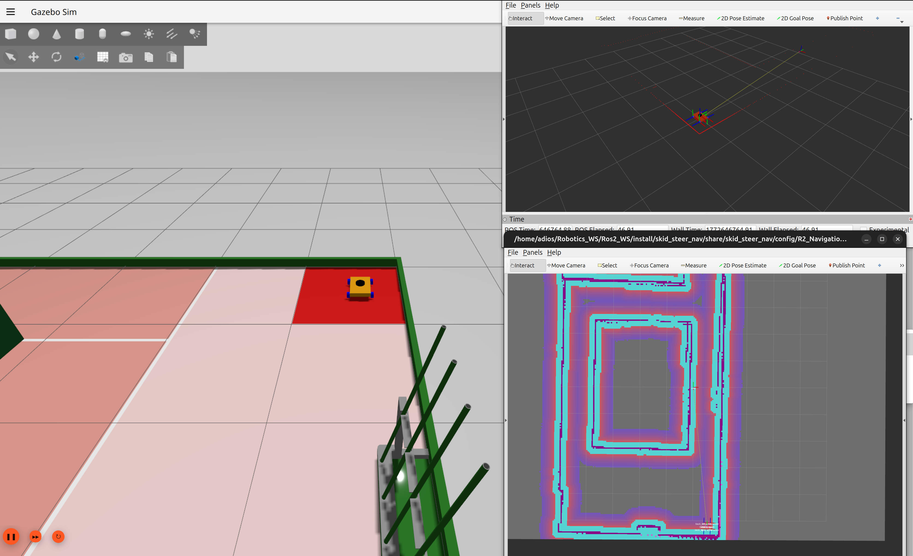
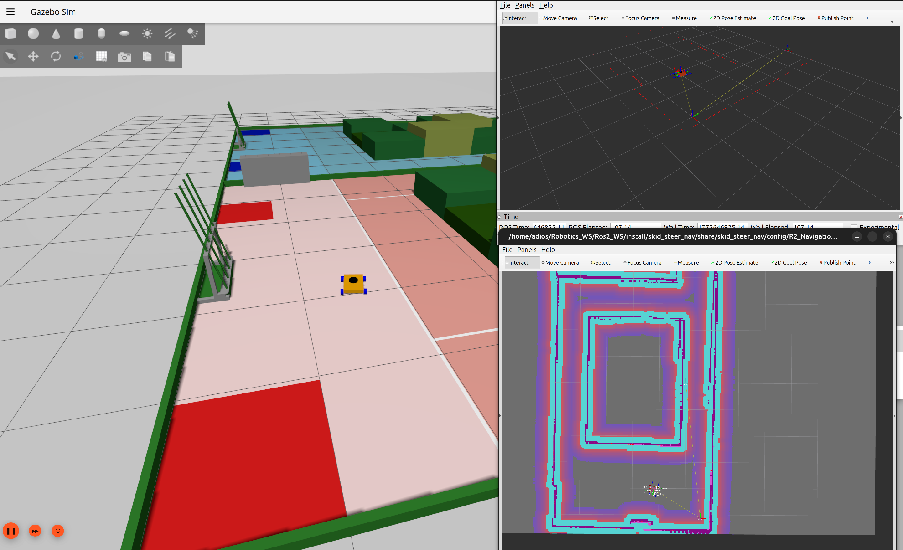

# SKID_STEER_NAV 🤖

A skid-steer robot simulation built with **ROS2 Jazzy** and **Gazebo Harmonic**, featuring accurate odometry and full autonomous navigation via Nav2.

---

## 📸 Demo

<p align="center">
  
  
</p>

> 🎥 Full navigation demo: [`Demos/DemoNav.mp4`](Demos/DemoNav.mp4)

---

## ✨ Features

- Accurate skid-steer odometry via `ros2_control` + `diff_drive_controller`
- Gazebo Harmonic simulation with a full URDF/Xacro robot model
- Two operation modes: **manual teleoperation** and **autonomous navigation**
- Nav2 integration with preloaded maps and waypoint following
- Joystick support with fully configurable button mappings
- RViz2 visualization

---

## 🛠️ Prerequisites

| Dependency | Version |
|---|---|
| ROS2 | Jazzy |
| Gazebo | Harmonic |
| Nav2 | (ros-jazzy-nav2-bringup) |
| teleop_twist_keyboard | Optional – keyboard control |

Install dependencies:
```bash
sudo apt install -y \
  ros-jazzy-ros-gz \
  ros-jazzy-ros-gz-bridge \
  ros-jazzy-xacro \
  ros-jazzy-joint-state-publisher \
  ros-jazzy-teleop-twist-keyboard \
  ros-jazzy-teleop-twist-joy \
  ros-jazzy-nav2-bringup \
  ros-jazzy-navigation2 \
  ros-jazzy-slam-toolbox
```

---

## 📦 Building
```bash
mkdir -p ~/ros2_ws/src
cd ~/ros2_ws/src
git clone <your-repo-url>
cd ~/ros2_ws
colcon build --packages-select skid_steer_nav
source install/setup.bash
```

---

## 🚀 Launch Modes

### Mode 1 — Simulation (Manual Control)

Spawns the robot in Gazebo Harmonic and opens RViz2. Control the robot manually via keyboard or joystick.
```bash
ros2 launch skid_steer_nav launch_sim.launch.py
```

**Keyboard control** (in a new terminal):
```bash
ros2 run teleop_twist_keyboard teleop_twist_keyboard
```

**Joystick control:**

Button mappings vary by controller (Xbox, PS4, Logitech, etc.) and can be configured in:
```
config/joystick.yaml
```

Launch with joystick:
```bash
ros2 launch skid_steer_nav joystick.launch.py
```

---

### Mode 2 — Bringup (Autonomous Navigation)

Spawns the robot in Gazebo Harmonic with a **preloaded map**, opens two RViz2 windows, and brings up the full Nav2 stack.
```bash
ros2 launch skid_steer_nav bringup.launch.py
```

**To navigate:**
1. In RViz2, click **2D Pose Estimate** → click and drag on the map to set the robot's starting position and orientation
2. Click **Nav2 Goal** → click and drag to send the robot to a target location
3. Use the **Waypoint Tool** to queue multiple sequential navigation goals

---

## 🗺️ Available Maps

| Map | Description |
|---|---|
| `ArenaBase` | Main arena environment |
| `RoboLvl` | Secondary map layout |

Maps are located in the `maps/` directory (`*.yaml`, `*.pgm`, `*.data`, `*.posegraph`).

---

## 📁 Project Structure
```
SKID_STEER_NAV/
├── config/
│   ├── diff_drive_controller.yaml    # ros2_control controller config
│   ├── gz_bridge.yaml                # Gazebo ↔ ROS2 topic bridge
│   ├── joystick.yaml                 # Joystick button mappings
│   ├── nav2_params.yaml              # Nav2 planner/controller params
│   ├── mapper_params_online_async.yaml
│   ├── JustBot.rviz                  # RViz config (sim mode)
│   └── R2_Navigation.rviz           # RViz config (nav mode)
│
├── Demos/
│   ├── DemoNav.mp4
│   ├── img1.png
│   └── img2.png
│
├── description/                      # Robot model (URDF/Xacro)
│   ├── robot.urdf.xacro
│   ├── robot_base.xacro
│   ├── ros2_control.xacro
│   ├── gazebo_control.xacro
│   ├── inertial_macros.xacro
│   └── lidar.xacro
│
├── launch/
│   ├── launch_sim.launch.py          # Simulation + manual control
│   ├── bringup.launch.py             # Nav2 autonomous navigation
│   ├── navigation_launch.py
│   ├── localization_launch.py
│   ├── joystick.launch.py
│   └── rsp.launch.py
│
├── maps/
│   ├── ArenaBase.yaml / .pgm / .data / .posegraph
│   └── RoboLvl.yaml  / .pgm / .data / .posegraph
│
├── worlds/
│   ├── robocon.world
│   └── empty.world
│
├── CMakeLists.txt
├── package.xml
└── README.md
```

---

## ⚙️ Configuration

### Joystick (`config/joystick.yaml`)
Different controllers use different axis/button indices. Edit this file to match your specific controller layout before launching.

### Nav2 (`config/nav2_params.yaml`)
Tune planner, controller, and costmap parameters here to adjust navigation behaviour such as obstacle inflation radius, speed limits, and planning algorithms.

---

## 📝 Notes

- The robot uses a **skid-steer drive** configuration managed via `ros2_control`
- Sensor and Gazebo topics are bridged to ROS2 using the `gz_bridge` config
- Odometry is published accurately and consumed directly by Nav2 for localization

---

## 📄 License

This project is open source. Feel free to use, modify, and build upon it.
